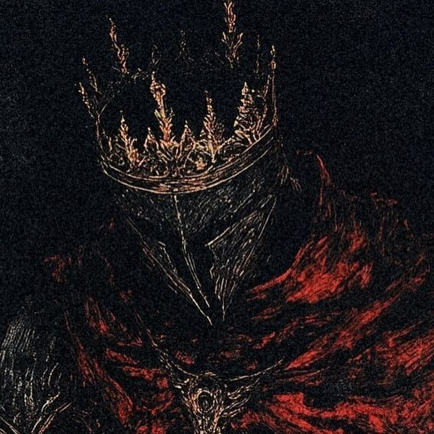

<!DOCTYPE html>
<html lang="en">
<head>
    <meta charset="UTF-8">
    <meta name="viewport" content="width=device-width, initial-scale=1.0">
    <title>Engineering Student Portfolio</title>
    
</head>
<body>
    <!-- Circuit Board Background -->
    

        <canvas id="circuitCanvas"></canvas>
    

    <!-- Navigation -->
    <nav>
        
⚡ Portfolio

        <ul class="nav-links">
            <li><a href="#home">Home</a></li>
            <li><a href="#about">About</a></li>
            <li><a href="#education">Education</a></li>
            <li><a href="#skills">Skills</a></li>
            <li><a href="#hobbies">Hobbies</a></li>
            <li><a href="#contact">Contact</a></li>
        </ul>
        

            <a href="#" aria-label="LinkedIn">in</a>
            <a href="#" aria-label="GitHub">⚙</a>
            <a href="#" aria-label="Twitter">🐦</a>
        

    </nav>

    <!-- Hero Section -->
    <section class="hero" id="home">
        

            <h1>Alan Fernandes</h1>
            
Fr. Conceicao Rodrigues College of Engineering, Bandra West

            
First Year Engineering Student passionate about technology, and innovation. <b>Moulding Engineers who can build the future</b>

            <a href="#contact" class="cta-button">Let's Connect →</a>
        

        

            

                
            

        

    </section>

    <!-- Skills Section -->
    <section class="skills" id="skills">
        <h3>Technical Skills</h3>
        

            
C Language

            
Basic Web Development

        

    </section>

    <!-- About Me Section -->
    <section class="about-me" id="about">
        <h2>About Me</h2>
        

            

                Hello! I'm a passionate first-year engineering student at Fr. Conceicao Rodrigues College of Engineering, 
                exploring the fascinating world of technology and innovation. My journey in engineering has just begun, 
                but I'm already captivated by the endless possibilities that lie ahead.
            

            

                I believe in learning by doing, and I'm constantly working on projects that challenge me to think 
                creatively and solve real-world problems. Whether it's coding, or design, I approach 
                every challenge with curiosity and determination.
            

            

                Beyond academics, I'm eager to collaborate, innovate, and make a positive impact through technology.
            

        

    </section>

    <!-- Education Section -->
    <section class="education" id="education">
        <h2>Education</h2>
        

            

                <h3>Bachelor of Engineering</h3>
                
Fr. Conceicao Rodrigues College of Engineering, Bandra West

                
2025 - 2029 (Expected)

                
Currently pursuing my engineering degree with a focus on building strong fundamentals in 
                mathematics, programming, and core engineering concepts.

            

            

                <h3>Higher Secondary Education (12th Grade)</h3>
                
Shri GPM College, Andheri East

                
2024 - 2025

                
Completed with a focus on Science stream, developing analytical and problem-solving skills.

            

            

                <h3>Secondary Education (10th Grade)</h3>
                
Holy Family High School, Andheri East

                
2022 - 2023

                
Built foundational knowledge in mathematics, science, and technology.

            

        

    </section>

    <!-- Hobbies Section -->
    <section class="hobbies" id="hobbies">
        <h2>Hobbies & Interests</h2>
        

            

                
💻

                <h3>Coding</h3>
                
Love solving programming challenges and building projects that bring ideas to life.

            

            

                
📚

                <h3>Reading</h3>
                
Enthusiastic reader of Philosophy and Literature

            

            

                
🎵

                <h3>Music</h3>
                
Finding inspiration and relaxation through British Rock

                <a href="https://open.spotify.com/playlist/6998fTw1ge0X7f3KAzY6Vm?si=0wmr9YHyS2SWtKL5z1ufJQ&pi=Ft7nZWc0RC6IV">View Playlist</a>

            

            

                
🚴

                <h3>Fitness</h3>
                
Spinning Miles, chasing sunrises, and fueled by excitement. Enthusiastic cyclist always ready for adventure!

            

        

    </section>

    <!-- Contact Section -->
    <section class="contact" id="contact">
        <h2>Get In Touch</h2>
        
Have a question or want to work together? Drop me a message!

        

            <form id="contactForm">
                

                    <label for="name">Your Name *</label>
                    <input type="text" id="name" name="name" placeholder="Enter your name" required>
                

                

                    <label for="email">Email Address *</label>
                    <input type="email" id="email" name="email" placeholder="your.email@example.com" required>
                

                

                    <label for="message">Message (Optional)</label>
                    <textarea id="message" name="message" placeholder="Tell me about your project or idea..."></textarea>
                

                <button type="submit" class="submit-btn">Send Message</button>
                

                    ✓ Thank you! Your message has been sent successfully.
                

            </form>
        

    </section>

    <!-- Footer -->
    <footer class="footer">
        
&copy; 2024 Your Name. Built with passion and coffee ☕

    </footer>

    
</body>
</html>
